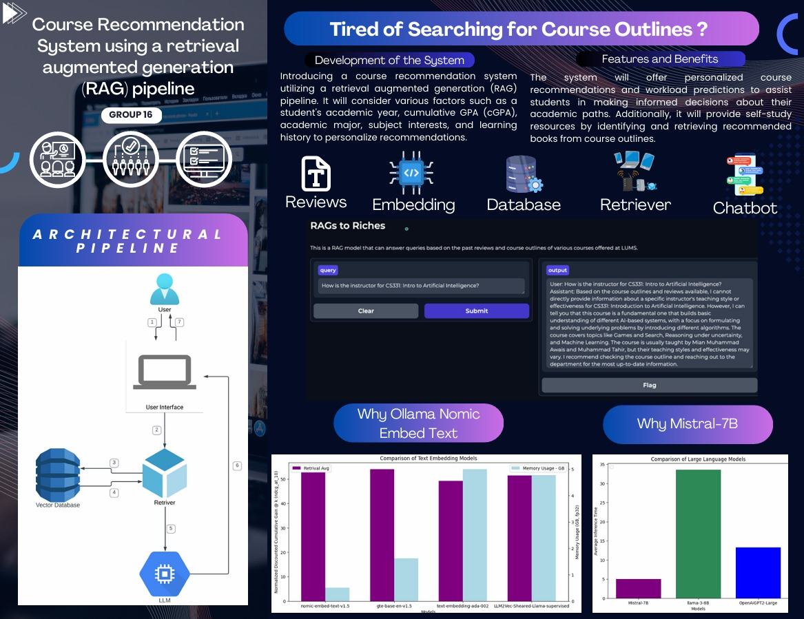

# 🎓 RAG-Based Course Recommender for Academic Advising

This repository contains the implementation of a **Retrieval-Augmented Generation (RAG)** system developed to assist university students in selecting the most suitable courses based on reviews, outlines, and historical feedback. The project was built as part of a university course on **Speech and Language Processing for Generative AI**, using state-of-the-art LLMs and embedding models.

> 📘 **Institution**: Lahore University of Management Sciences (LUMS)  
> 🧠 **Course**: Speech & Language Processing for Generative AI  
> 🗓️ **Semester**: Spring 2024

---

## 🧠 Project Overview

The system provides a personalized academic advising chatbot powered by a RAG pipeline. It retrieves relevant course reviews and outlines based on user queries and uses a fine-tuned LLM to provide concise, informed responses about course workload, difficulty, prerequisites, and study suggestions.

The backend integrates:
- Rich historical reviews gathered from the **LUMS Discussion Forum** and Google Forms
- Manually curated **course outlines** from the Registrar Portal
- Semantic **vector embedding** using `nomic-embed-text`
- **Conversational memory** using LangChain to support follow-up queries

---

## 🖼️ Pipeline Overview



---

## 📁 Directory Structure

```
RAG-Course-Recommender/
│
├── data/                          # Raw and processed academic data
│   ├── course reviews/           # Collected Google Form + LDF reviews
│   └── vector_store_nomic/       # Precomputed vector embeddings
│
├── flagged/                      # Manually flagged outputs (low quality)
│
├── notebooks/                    # Development notebooks
│   └── main.ipynb
│
├── report/                       # Final submission documents
│   ├── G16-Final_Report.pdf
│   └── G16-Poster.pdf
│
├── Pipeline.jpeg                 # Architectural pipeline visualization
├── requirements.txt              # Python dependencies
├── README.md                     # Project documentation
├── .gitignore
└── .DS_Store                     # (To be deleted)
```

---

## 🔧 Technical Stack

| Component             | Technology Used                         |
|----------------------|------------------------------------------|
| Vector Embedding      | `nomic-embed-text` from Ollama           |
| Vector Store          | ChromaDB (via LangChain)                 |
| Language Model        | `mistralai/Mistral-7B-Instruct-v0.2`     |
| Prompt Template       | LangChain PromptTemplate                 |
| Memory Chain          | LangChain ConversationBufferMemory       |
| Document Loaders      | `PyPDFLoader`, `Docx2txtLoader`          |
| Interface             | Gradio with local + ngrok link sharing   |

---

## ✨ Key Features

- 🔍 **Semantic Document Retrieval**: Matches user prompts with relevant reviews and outlines  
- 🧠 **LLM-Powered Reasoning**: Generates summaries, advice, and answers using context-aware prompts  
- 💬 **Conversational Memory**: Tracks prior queries to support follow-up questions  
- 📊 **Multi-source Data**: Combines formal outlines and student opinions  
- 🌐 **Gradio Interface**: Lightweight, shareable user interface for easy access

---

## 🚀 Getting Started

### Prerequisites

- Python 3.9+
- `pip` or `conda`

### Installation

```bash
git clone https://github.com/SaadH-077/RAG-Course-Recommender.git
cd RAG-Course-Recommender
pip install -r requirements.txt
```

---

## ▶️ Running the Application

You can launch the interactive chatbot through the Gradio interface by running:

```bash
python main.py
```

This will start a local server (and optionally a public link via ngrok).

---

## 📄 Final Deliverables

- 📘 [G16-Final Report (PDF)](report/G16-Final_Report.pdf)
- 📊 [G16 Poster Presentation (PDF)](report/G16-Poster.pdf)

These documents contain detailed methodology, model comparisons, results, and future work.

---

## 📌 Citation

If you reference this project in academic or practical work:

```bibtex
@project{RAGCourseAdviser2025,
  title = {RAG-Based Course Recommender for Academic Advising},
  note = {Developed for Speech & Language Processing for Generative AI, Spring 2025, LUMS}
}
```

---

> “Retrieval grounds generation — context is not optional, it's everything.”
